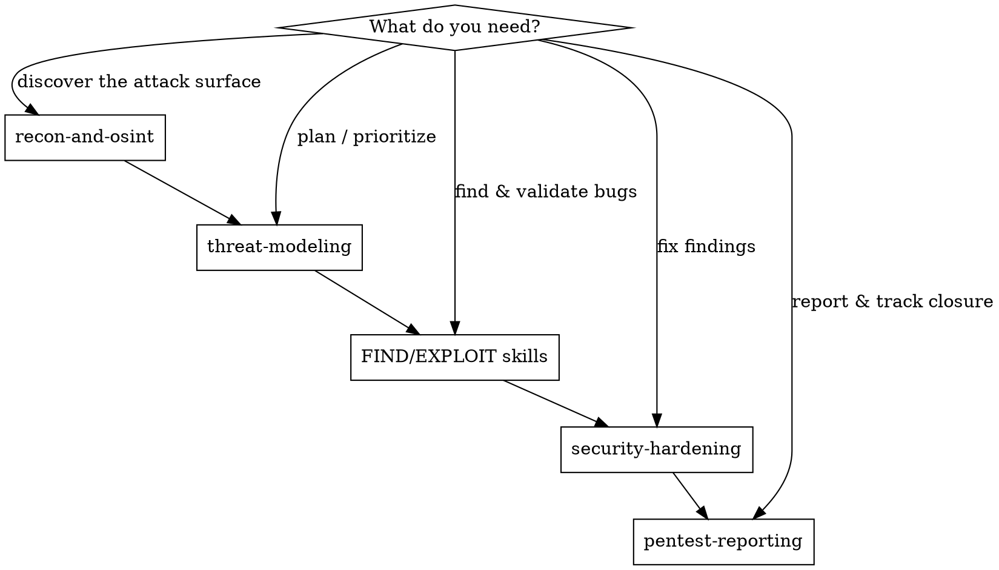

# Security Testing (Orchestrator)

## Overview
Front door for defensive security work. It enforces an authorization gate, then routes
you through the lifecycle: **PLAN → FIND → EXPLOIT → FIX**. Use attacker thinking to find
your own weaknesses, then close them.

**Core principle:** Attackers think in *paths*, defenders think in *lists*. A defender must
be right everywhere; an attacker needs one weak link. Hunt the path.

## How to run this orchestrator (MANDATORY — read first)
This skill is a **router, not a substitute** for the skills it names. The tables below tell you
*which* skill to open at each phase — you MUST actually open it with the `Skill` tool.

**The rule:** before doing the work of a phase, invoke that phase's skill and follow its
checklist. Reading a one-line description in a routing table is NOT running the skill and does
NOT count as coverage. Doing the work "from your own expertise" instead of invoking the skill is
the failure this section exists to stop.

- RECON → `recon-and-osint`  ·  PLAN → `threat-modeling`
- FIND/EXPLOIT → invoke **each applicable** specialist (`access-control-testing`,
  `authentication-testing`, `injection-testing`, `file-upload-and-ssrf`, `api-security-testing`,
  `client-side-exploitation`, `business-logic-testing`, `secrets-management-audit`) **before**
  testing that area — plus `security-code-audit` (static) and `active-pentest` (dynamic).
- CHAIN → `vulnerability-chaining`  ·  FIX → `security-hardening`  ·  REPORT → `pentest-reporting`

**Coverage honesty:** in the coverage report, mark a skill ✓ ONLY if you invoked it via the
`Skill` tool. If you applied its methodology from memory without invoking it, write
"methodology-only". If it's irrelevant to the target, write "N/A — <reason>". Never mark ✓ to
mean "I did similar work."

**Red flags — STOP and invoke the skill before continuing:**
- "I already know what this covers / I know this domain extremely well"
- "The summary in the routing table is enough"
- "I'll just start with the highest-yield target and do the work directly"
- "I'll consult the specialist skills later / as a reference"
- "The skill is overkill — I've found these bugs hundreds of times"
- Time pressure: "the user wants results fast, skip the load step"

Each of these is the exact rationalization that produces silent gaps. The map is not the
territory — open each door (call `Skill`) before doing its work.

## Authorization Gate (do this first — every time)
Before any testing, confirm out loud with the user:

1. **Ownership / authorization** — Do you own this app, or have written permission to test it?
2. **Target environment** — Is testing scoped to a lab/staging/local instance (not third-party production)?
3. **Out of scope** — Confirm no destructive actions, no DoS, no real user data exfiltration.

If any answer is unclear or "no" → **stop** and only do code audit on code the user controls.
Never test third-party systems without written authorization.

## Routing



**Lifecycle phases (run in order for a full assessment):**

| Phase | Skill | When |
|-------|-------|------|
| RECON | `recon-and-osint` | Discover the real attack surface before assuming it. |
| PLAN | `threat-modeling` | Rank what to worry about and test first. |
| FIND/EXPLOIT | *deep-dive specialists (below)* | Find and validate vulnerabilities. |
| FIX | `security-hardening` | Correct, verified fixes. |
| REPORT | `pentest-reporting` | Score, document, and track findings to closure. |

**FIND/EXPLOIT deep-dive specialists (pick by what you're testing):**

| Target | Skill |
|--------|-------|
| Access control / IDOR / privesc (OWASP #1) | `access-control-testing` |
| Login / sessions / OAuth / JWT / MFA (account takeover) | `authentication-testing` |
| Workflow / pricing / race conditions / abuse | `business-logic-testing` |
| REST / GraphQL / gRPC / WebSocket (OWASP API Top 10) | `api-security-testing` |
| Browser / HTTP layer (DOM XSS, CSP/CORS, prototype pollution, smuggling) | `client-side-exploitation` |
| Input reaching an interpreter (SQLi/NoSQLi, command, SSTI, XXE) | `injection-testing` |
| File uploads, SSRF, insecure deserialization | `file-upload-and-ssrf` |
| Leaked keys/tokens (code, git history, logs, config) | `secrets-management-audit` |

**Then synthesize:** `vulnerability-chaining` combines the findings above into end-to-end attack
paths — the highest-impact step, where several mediums become one critical.

**Two cross-cutting helpers the specialists use:**
- `security-code-audit` — **static** (white-box) review: read source & grep for vuln patterns.
- `active-pentest` — **execution harness**: lab/proxy/scanner setup + safe run + PoC capture.
  The specialists supply the attack recipe; `active-pentest` is how you run it on the live app.

**Recommended flow:** recon → threat model → deep-dive find/exploit (start with
`access-control-testing`, it's the #1 real-world risk) → harden → report. Each phase feeds the next.

## Surface-driven routing (applicability & gaps)
Don't run every skill — run what the target *has*. From `recon-and-osint` + `threat-modeling`,
build the **surface inventory**, then map present surfaces to specialists:

| Surface present? | Route to | If absent |
|---|---|---|
| Browser UI / client-side JS | `client-side-exploitation` | skip (N/A) |
| Login / accounts / tokens | `authentication-testing` | skip |
| Authenticated / multi-user data | `access-control-testing` | skip |
| API (REST/GraphQL/gRPC/WS) | `api-security-testing` | skip |
| DB / shell / template / XML sinks | `injection-testing` | skip (per sink) |
| File upload / URL fetch / deserialization | `file-upload-and-ssrf` | skip (per feature) |
| Workflows / money / quotas | `business-logic-testing` | skip |
| Any code / repo / config (≈always) | `secrets-management-audit` | — |

Each specialist also self-checks via its own **Applies when / Skip when** block — so a frontend
skill pointed at a headless API reports `N/A` and stops instead of producing noise.

**Gap check (the inverse — surface with no specialist):** for every surface in the inventory that
**no** specialist covers (e.g. a custom binary protocol, a message bus, an IoT/firmware endpoint):
1. **Flag it explicitly** — never let it pass as "covered."
2. **Fall back** to generic `security-code-audit` (static) + `active-pentest` (dynamic) methodology.
3. **Recommend a new specialist** for it.

**Always emit a coverage report** so it's clear what ran, what was skipped *and why*, and what
has no coverage:
```
Frontend ...... none  → client-side-exploitation: N/A (skipped)
API (REST) .... yes   → api-security-testing, access-control-testing ✓
Uploads ....... none  → file-upload-and-ssrf: N/A (skipped)
gRPC stream ... yes   → ⚠ GAP: generic methodology + consider a new specialist
```

## Output of a full run
- A ranked threat model (what matters most)
- A findings register: severity · `file:line` · why exploitable · status
- Validated PoCs for high-severity items
- Applied fixes, each with a re-test confirming closure

## Common mistakes
- **Reading the routing table instead of invoking the skills it routes to** → the summaries are
  a map, not the territory. Open each door (call the `Skill` tool) before doing its work, and
  mark it ✓ only if you actually invoked it (see "How to run this orchestrator").
- **Skipping the threat model** → you test random things, miss the crown jewels.
- **Auditing without authorization to test the live system** → stay in code audit only.
- **Finding without fixing/re-testing** → a report nobody acts on isn't security.
